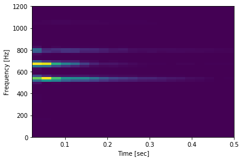

---
comments:
- email: bayanbatn@gmail.com
  ts: 1537756764549
  content: commenting is cool

---


# Okay here's the new thing


```{python3}
import matplotlib.pyplot as plt
from scipy import signal
from scipy.io import wavfile

sample_rate, samples = wavfile.read('rendered/C_maj.wav')
frequencies, times, spectrogram = signal.spectrogram(
  samples.mean(axis=-1), # stereo?
  sample_rate,
  window=signal.get_window('hann',2000),
  noverlap=1000,
  nperseg=2000,
)
print(len(frequencies))
```
<div class="python3">
    <div class="stdout">
        <pre>1001
</pre>
    </div>
</div>


```{python3}
plt.pcolormesh(times, frequencies, spectrogram)
plt.ylabel('Frequency [Hz]')
plt.xlabel('Time [sec]')
plt.ylim(top=1200)
plt.xlim(right=0.5)
plt.show()
```
<div class="python3">
    <div class="display">
        <div class="display-data result-image-container" data-mime-type="image/png">
            
        </div>
    </div>
</div>


```{python3}
chord_variants = [
  '_maj', '_min', 'b_maj', 'b_min']
chord_classes = [
  'A', 'B', 'C', 'D', 'E', 'F', 'G']
import itertools
chords = itertools.product(chord_classes, chord_variants)
chords = [row[0]+row[1] for row in chords]
label_to_chord = dict(enumerate(chords))
chord_to_label = dict((row[1], row[0]) for row in enumerate(chords))
```


# Generate Training Set

```{python3}
train_data = []
train_labels = []
for chord in chords:
  try:
    sample_rate, samples = wavfile.read(f'rendered/{chord}.wav')
  except FileNotFoundError:
    continue
  frequencies, times, spectrogram = signal.spectrogram(
    samples.mean(axis=-1), # stereo?
    sample_rate,
    window=signal.get_window('hann',2000),
    noverlap=1000,
    nperseg=2000,
  )
  train_data.append(spectrogram)
  train_labels.append(chord_to_label[chord])
  print(f'finished running for {chord} chord')
```
<div class="python3">
    <div class="stdout">
        <pre>finished running for A_maj chord
finished running for A_min chord
finished running for Ab_maj chord
finished running for Ab_min chord
finished running for B_maj chord
finished running for B_min chord
finished running for Bb_maj chord
finished running for Bb_min chord
finished running for C_maj chord
finished running for C_min chord
finished running for D_maj chord
finished running for D_min chord
finished running for Db_maj chord
finished running for Db_min chord
finished running for E_maj chord
finished running for E_min chord
finished running for Eb_maj chord
finished running for Eb_min chord
finished running for F_maj chord
finished running for F_min chord
finished running for G_maj chord
finished running for G_min chord
finished running for Gb_maj chord
finished running for Gb_min chord
</pre>
    </div>
</div>

```{python3}
print(train_data[0].shape)
print(train_data[1].shape)
print(len(train_data))
```
<div class="python3">
    <div class="stdout">
        <pre>(1001, 131)
(1001, 131)
24
</pre>
    </div>
</div>

```{python3}
frequencies
```
<div class="python3">
    <div class="result">
        <pre>array([    0.  ,    22.05,    44.1 , ..., 22005.9 , 22027.95, 22050.  ])</pre>
    </div>
</div>


# Train Trivial Model

```{bash}
pip3 install --user --upgrade tensorflow
```
<div class="bash">
    <div class="stdout">
        <pre>Collecting tensorflow
  Using cached https://files.pythonhosted.org/packages/04/7e/a484776c73b1431f2b077e13801531e966113492552194fe721e6ef88d5d/tensorflow-1.10.1-cp36-cp36m-manylinux1_x86_64.whl
Collecting setuptools&lt;=39.1.0 (from tensorflow)
  Using cached https://files.pythonhosted.org/packages/8c/10/79282747f9169f21c053c562a0baa21815a8c7879be97abd930dbcf862e8/setuptools-39.1.0-py2.py3-none-any.whl
Collecting tensorboard&lt;1.11.0,&gt;=1.10.0 (from tensorflow)
  Using cached https://files.pythonhosted.org/packages/c6/17/ecd918a004f297955c30b4fffbea100b1606c225dbf0443264012773c3ff/tensorboard-1.10.0-py3-none-any.whl
Collecting absl-py&gt;=0.1.6 (from tensorflow)
Collecting numpy&lt;=1.14.5,&gt;=1.13.3 (from tensorflow)
  Using cached https://files.pythonhosted.org/packages/68/1e/116ad560de97694e2d0c1843a7a0075cc9f49e922454d32f49a80eb6f1f2/numpy-1.14.5-cp36-cp36m-manylinux1_x86_64.whl
Collecting termcolor&gt;=1.1.0 (from tensorflow)
Collecting grpcio&gt;=1.8.6 (from tensorflow)
  Using cached https://files.pythonhosted.org/packages/a7/9c/523fec4e50cd4de5effeade9fab6c1da32e7e1d72372e8e514274ffb6509/grpcio-1.15.0-cp36-cp36m-manylinux1_x86_64.whl
Collecting astor&gt;=0.6.0 (from tensorflow)
  Using cached https://files.pythonhosted.org/packages/35/6b/11530768cac581a12952a2aad00e1526b89d242d0b9f59534ef6e6a1752f/astor-0.7.1-py2.py3-none-any.whl
Collecting gast&gt;=0.2.0 (from tensorflow)
Collecting wheel&gt;=0.26 (from tensorflow)
  Using cached https://files.pythonhosted.org/packages/81/30/e935244ca6165187ae8be876b6316ae201b71485538ffac1d718843025a9/wheel-0.31.1-py2.py3-none-any.whl
Collecting protobuf&gt;=3.6.0 (from tensorflow)
  Using cached https://files.pythonhosted.org/packages/c2/f9/28787754923612ca9bfdffc588daa05580ed70698add063a5629d1a4209d/protobuf-3.6.1-cp36-cp36m-manylinux1_x86_64.whl
Collecting six&gt;=1.10.0 (from tensorflow)
  Using cached https://files.pythonhosted.org/packages/67/4b/141a581104b1f6397bfa78ac9d43d8ad29a7ca43ea90a2d863fe3056e86a/six-1.11.0-py2.py3-none-any.whl
Collecting markdown&gt;=2.6.8 (from tensorboard&lt;1.11.0,&gt;=1.10.0-&gt;tensorflow)
  Using cached https://files.pythonhosted.org/packages/7a/fd/e22357c299e93c0bc11ec8ba54e79f98dd568e09adfe9b39d6852c744938/Markdown-3.0-py2.py3-none-any.whl
Collecting werkzeug&gt;=0.11.10 (from tensorboard&lt;1.11.0,&gt;=1.10.0-&gt;tensorflow)
  Using cached https://files.pythonhosted.org/packages/20/c4/12e3e56473e52375aa29c4764e70d1b8f3efa6682bef8d0aae04fe335243/Werkzeug-0.14.1-py2.py3-none-any.whl
Installing collected packages: setuptools, numpy, six, protobuf, markdown, werkzeug, wheel, tensorboard, absl-py, termcolor, grpcio, astor, gast, tensorflow
Successfully installed absl-py-0.5.0 astor-0.7.1 gast-0.2.0 grpcio-1.15.0 markdown-3.0 numpy-1.14.5 protobuf-3.6.1 setuptools-39.1.0 six-1.11.0 tensorboard-1.10.0 tensorflow-1.10.1 termcolor-1.1.0 werkzeug-0.14.1 wheel-0.31.1
</pre>
    </div>
</div>

```{bash}
python3 -c "import tensorflow as tf; print(tf.__version__)"
```
<div class="bash">
    <div class="stdout">
        <pre>1.10.1
</pre>
    </div>
</div>

```{bash}
pip3 install --user keras
```
<div class="bash">
    <div class="stdout">
        <pre>Collecting keras
[?25l  Downloading https://files.pythonhosted.org/packages/34/7d/b1dedde8af99bd82f20ed7e9697aac0597de3049b1f786aa2aac3b9bd4da/Keras-2.2.2-py2.py3-none-any.whl (299kB)

    3% |█                               | 10kB 22.3MB/s eta 0:00:01
    6% |██▏                             | 20kB 2.8MB/s eta 0:00:01
    10% |███▎                            | 30kB 3.3MB/s eta 0:00:01
    13% |████▍                           | 40kB 3.0MB/s eta 0:00:01
    17% |█████▌                          | 51kB 3.4MB/s eta 0:00:01
    20% |██████▋                         | 61kB 4.0MB/s eta 0:00:01
    23% |███████▋                        | 71kB 4.0MB/s eta 0:00:01
    27% |████████▊                       | 81kB 4.0MB/s eta 0:00:01
    30% |█████████▉                      | 92kB 4.4MB/s eta 0:00:01
    34% |███████████                     | 102kB 4.5MB/s eta 0:00:01
    37% |████████████                    | 112kB 4.5MB/s eta 0:00:01
    41% |█████████████▏                  | 122kB 5.9MB/s eta 0:00:01
    44% |██████████████▎                 | 133kB 5.3MB/s eta 0:00:01
    47% |███████████████▎                | 143kB 6.8MB/s eta 0:00:01
    51% |████████████████▍               | 153kB 7.0MB/s eta 0:00:01
    54% |█████████████████▌              | 163kB 5.9MB/s eta 0:00:01
    58% |██████████████████▋             | 174kB 6.8MB/s eta 0:00:01
    61% |███████████████████▊            | 184kB 7.6MB/s eta 0:00:01
    65% |████████████████████▉           | 194kB 7.6MB/s eta 0:00:01
    68% |██████████████████████          | 204kB 7.3MB/s eta 0:00:01
    71% |███████████████████████         | 215kB 6.5MB/s eta 0:00:01
    75% |████████████████████████        | 225kB 7.2MB/s eta 0:00:01
    78% |█████████████████████████▏      | 235kB 8.0MB/s eta 0:00:01
    82% |██████████████████████████▎     | 245kB 5.7MB/s eta 0:00:01
    85% |███████████████████████████▍    | 256kB 6.1MB/s eta 0:00:01
    88% |████████████████████████████▌   | 266kB 7.2MB/s eta 0:00:01
    92% |█████████████████████████████▋  | 276kB 7.1MB/s eta 0:00:01
    95% |██████████████████████████████▋ | 286kB 7.6MB/s eta 0:00:01
    99% |███████████████████████████████▊| 296kB 7.4MB/s eta 0:00:01
    100% |████████████████████████████████| 307kB 7.9MB/s 
[?25hRequirement already satisfied: numpy&gt;=1.9.1 in /usr/local/lib/python2.7/dist-packages (from keras) (1.15.1)
Collecting keras-preprocessing==1.0.2 (from keras)
  Downloading https://files.pythonhosted.org/packages/71/26/1e778ebd737032749824d5cba7dbd3b0cf9234b87ab5ec79f5f0403ca7e9/Keras_Preprocessing-1.0.2-py2.py3-none-any.whl
Requirement already satisfied: scipy&gt;=0.14 in /usr/local/lib/python2.7/dist-packages (from keras) (1.1.0)
Collecting h5py (from keras)
[?25l  Downloading https://files.pythonhosted.org/packages/33/0c/1c5dfa85e05052aa5f50969d87c67a2128dc39a6f8ce459a503717e56bd0/h5py-2.8.0-cp27-cp27mu-manylinux1_x86_64.whl (2.7MB)

    0% |▏                               | 10kB 25.3MB/s eta 0:00:01
    0% |▎                               | 20kB 12.7MB/s eta 0:00:01
    1% |▍                               | 30kB 16.8MB/s eta 0:00:01
    1% |▌                               | 40kB 11.6MB/s eta 0:00:01
    1% |▋                               | 51kB 8.0MB/s eta 0:00:01
    2% |▊                               | 61kB 9.3MB/s eta 0:00:01
    2% |▉                               | 71kB 9.1MB/s eta 0:00:01
    3% |█                               | 81kB 10.2MB/s eta 0:00:01
    3% |█                               | 92kB 9.6MB/s eta 0:00:01
    3% |█▏                              | 102kB 9.1MB/s eta 0:00:01
    4% |█▎                              | 112kB 9.4MB/s eta 0:00:01
    4% |█▍                              | 122kB 8.7MB/s eta 0:00:01
    4% |█▋                              | 133kB 7.7MB/s eta 0:00:01
    5% |█▊                              | 143kB 8.8MB/s eta 0:00:01
    5% |█▉                              | 153kB 9.1MB/s eta 0:00:01
    6% |██                              | 163kB 9.1MB/s eta 0:00:01
    6% |██                              | 174kB 9.9MB/s eta 0:00:01
    6% |██▏                             | 184kB 8.3MB/s eta 0:00:01
    7% |██▎                             | 194kB 9.4MB/s eta 0:00:01
    7% |██▍                             | 204kB 9.4MB/s eta 0:00:01
    7% |██▌                             | 215kB 7.7MB/s eta 0:00:01
    8% |██▋                             | 225kB 9.0MB/s eta 0:00:01
    8% |██▊                             | 235kB 10.1MB/s eta 0:00:01
    9% |██▉                             | 245kB 10.1MB/s eta 0:00:01
    9% |███                             | 256kB 10.5MB/s eta 0:00:01
    9% |███▏                            | 266kB 9.1MB/s eta 0:00:01
    10% |███▎                            | 276kB 9.2MB/s eta 0:00:01
    10% |███▍                            | 286kB 10.5MB/s eta 0:00:01
    10% |███▌                            | 296kB 8.9MB/s eta 0:00:01
    11% |███▋                            | 307kB 10.1MB/s eta 0:00:01
    11% |███▊                            | 317kB 10.5MB/s eta 0:00:01
    12% |███▉                            | 327kB 9.3MB/s eta 0:00:01
    12% |████                            | 337kB 9.6MB/s eta 0:00:01
    12% |████                            | 348kB 8.7MB/s eta 0:00:01
    13% |████▏                           | 358kB 10.4MB/s eta 0:00:01
    13% |████▎                           | 368kB 10.8MB/s eta 0:00:01
    13% |████▌                           | 378kB 9.1MB/s eta 0:00:01
    14% |████▋                           | 389kB 9.7MB/s eta 0:00:01
    14% |████▊                           | 399kB 10.8MB/s eta 0:00:01
    15% |████▉                           | 409kB 9.3MB/s eta 0:00:01
    15% |█████                           | 419kB 11.4MB/s eta 0:00:01
    15% |█████                           | 430kB 12.0MB/s eta 0:00:01
    16% |█████▏                          | 440kB 12.1MB/s eta 0:00:01
    16% |█████▎                          | 450kB 11.3MB/s eta 0:00:01
    16% |█████▍                          | 460kB 9.9MB/s eta 0:00:01
    17% |█████▌                          | 471kB 11.3MB/s eta 0:00:01
    17% |█████▋                          | 481kB 11.0MB/s eta 0:00:01
    18% |█████▊                          | 491kB 10.7MB/s eta 0:00:01
    18% |██████                          | 501kB 11.4MB/s eta 0:00:01
    18% |██████                          | 512kB 10.6MB/s eta 0:00:01
    19% |██████▏                         | 522kB 10.6MB/s eta 0:00:01
    19% |██████▎                         | 532kB 11.4MB/s eta 0:00:01
    19% |██████▍                         | 542kB 10.0MB/s eta 0:00:01
    20% |██████▌                         | 552kB 11.8MB/s eta 0:00:01
    20% |██████▋                         | 563kB 11.0MB/s eta 0:00:01
    21% |██████▊                         | 573kB 10.0MB/s eta 0:00:01
    21% |██████▉                         | 583kB 12.5MB/s eta 0:00:01
    21% |███████                         | 593kB 10.9MB/s eta 0:00:01
    22% |███████                         | 604kB 10.9MB/s eta 0:00:01
    22% |███████▏                        | 614kB 13.8MB/s eta 0:00:01
    22% |███████▍                        | 624kB 10.8MB/s eta 0:00:01
    23% |███████▌                        | 634kB 10.9MB/s eta 0:00:01
    23% |███████▋                        | 645kB 10.9MB/s eta 0:00:01
    24% |███████▊                        | 655kB 10.6MB/s eta 0:00:01
    24% |███████▉                        | 665kB 13.4MB/s eta 0:00:01
    24% |████████                        | 675kB 11.8MB/s eta 0:00:01
    25% |████████                        | 686kB 11.9MB/s eta 0:00:01
    25% |████████▏                       | 696kB 12.6MB/s eta 0:00:01
    25% |████████▎                       | 706kB 11.5MB/s eta 0:00:01
    26% |████████▍                       | 716kB 11.8MB/s eta 0:00:01
    26% |████████▌                       | 727kB 14.4MB/s eta 0:00:01
    27% |████████▋                       | 737kB 11.6MB/s eta 0:00:01
    27% |████████▊                       | 747kB 13.3MB/s eta 0:00:01
    27% |█████████                       | 757kB 10.8MB/s eta 0:00:01
    28% |█████████                       | 768kB 10.8MB/s eta 0:00:01
    28% |█████████▏                      | 778kB 13.3MB/s eta 0:00:01
    28% |█████████▎                      | 788kB 12.2MB/s eta 0:00:01
    29% |█████████▍                      | 798kB 13.9MB/s eta 0:00:01
    29% |█████████▌                      | 808kB 14.6MB/s eta 0:00:01
    30% |█████████▋                      | 819kB 11.2MB/s eta 0:00:01
    30% |█████████▊                      | 829kB 11.9MB/s eta 0:00:01
    30% |█████████▉                      | 839kB 13.8MB/s eta 0:00:01
    31% |██████████                      | 849kB 13.9MB/s eta 0:00:01
    31% |██████████                      | 860kB 14.7MB/s eta 0:00:01
    31% |██████████▏                     | 870kB 14.0MB/s eta 0:00:01
    32% |██████████▍                     | 880kB 14.2MB/s eta 0:00:01
    32% |██████████▌                     | 890kB 13.2MB/s eta 0:00:01
    33% |██████████▋                     | 901kB 11.9MB/s eta 0:00:01
    33% |██████████▊                     | 911kB 12.5MB/s eta 0:00:01
    33% |██████████▉                     | 921kB 14.6MB/s eta 0:00:01
    34% |███████████                     | 931kB 14.6MB/s eta 0:00:01
    34% |███████████                     | 942kB 14.4MB/s eta 0:00:01
    34% |███████████▏                    | 952kB 11.1MB/s eta 0:00:01
    35% |███████████▎                    | 962kB 13.5MB/s eta 0:00:01
    35% |███████████▍                    | 972kB 13.7MB/s eta 0:00:01
    36% |███████████▌                    | 983kB 12.1MB/s eta 0:00:01
    36% |███████████▋                    | 993kB 14.1MB/s eta 0:00:01
    36% |███████████▉                    | 1.0MB 14.6MB/s eta 0:00:01
    37% |████████████                    | 1.0MB 14.5MB/s eta 0:00:01
    37% |████████████                    | 1.0MB 14.6MB/s eta 0:00:01
    37% |████████████▏                   | 1.0MB 13.4MB/s eta 0:00:01
    38% |████████████▎                   | 1.0MB 14.6MB/s eta 0:00:01
    38% |████████████▍                   | 1.1MB 14.7MB/s eta 0:00:01
    39% |████████████▌                   | 1.1MB 14.0MB/s eta 0:00:01
    39% |████████████▋                   | 1.1MB 14.5MB/s eta 0:00:01
    39% |████████████▊                   | 1.1MB 14.7MB/s eta 0:00:01
    40% |████████████▉                   | 1.1MB 14.9MB/s eta 0:00:01
    40% |█████████████                   | 1.1MB 14.5MB/s eta 0:00:01
    40% |█████████████                   | 1.1MB 13.6MB/s eta 0:00:01
    41% |█████████████▎                  | 1.1MB 15.5MB/s eta 0:00:01
    41% |█████████████▍                  | 1.1MB 15.8MB/s eta 0:00:01
    42% |█████████████▌                  | 1.1MB 13.9MB/s eta 0:00:01
    42% |█████████████▋                  | 1.2MB 19.3MB/s eta 0:00:01
    42% |█████████████▊                  | 1.2MB 15.3MB/s eta 0:00:01
    43% |█████████████▉                  | 1.2MB 15.3MB/s eta 0:00:01
    43% |██████████████                  | 1.2MB 16.6MB/s eta 0:00:01
    43% |██████████████                  | 1.2MB 14.3MB/s eta 0:00:01
    44% |██████████████▏                 | 1.2MB 16.1MB/s eta 0:00:01
    44% |██████████████▎                 | 1.2MB 14.7MB/s eta 0:00:01
    45% |██████████████▍                 | 1.2MB 14.7MB/s eta 0:00:01
    45% |██████████████▌                 | 1.2MB 15.8MB/s eta 0:00:01
    45% |██████████████▊                 | 1.2MB 16.7MB/s eta 0:00:01
    46% |██████████████▉                 | 1.3MB 16.6MB/s eta 0:00:01
    46% |███████████████                 | 1.3MB 20.3MB/s eta 0:00:01
    46% |███████████████                 | 1.3MB 14.9MB/s eta 0:00:01
    47% |███████████████▏                | 1.3MB 15.6MB/s eta 0:00:01
    47% |███████████████▎                | 1.3MB 17.5MB/s eta 0:00:01
    48% |███████████████▍                | 1.3MB 15.0MB/s eta 0:00:01
    48% |███████████████▌                | 1.3MB 17.7MB/s eta 0:00:01
    48% |███████████████▋                | 1.3MB 14.9MB/s eta 0:00:01
    49% |███████████████▊                | 1.3MB 14.8MB/s eta 0:00:01
    49% |███████████████▉                | 1.4MB 14.7MB/s eta 0:00:01
    49% |████████████████                | 1.4MB 13.1MB/s eta 0:00:01
    50% |████████████████                | 1.4MB 14.3MB/s eta 0:00:01
    50% |████████████████▎               | 1.4MB 18.9MB/s eta 0:00:01
    51% |████████████████▍               | 1.4MB 18.5MB/s eta 0:00:01
    51% |████████████████▌               | 1.4MB 19.6MB/s eta 0:00:01
    51% |████████████████▋               | 1.4MB 17.4MB/s eta 0:00:01
    52% |████████████████▊               | 1.4MB 17.5MB/s eta 0:00:01
    52% |████████████████▉               | 1.4MB 18.1MB/s eta 0:00:01
    52% |█████████████████               | 1.4MB 18.2MB/s eta 0:00:01
    53% |█████████████████               | 1.5MB 20.2MB/s eta 0:00:01
    53% |█████████████████▏              | 1.5MB 18.4MB/s eta 0:00:01
    54% |█████████████████▎              | 1.5MB 14.9MB/s eta 0:00:01
    54% |█████████████████▍              | 1.5MB 14.9MB/s eta 0:00:01
    54% |█████████████████▌              | 1.5MB 14.9MB/s eta 0:00:01
    55% |█████████████████▊              | 1.5MB 14.9MB/s eta 0:00:01
    55% |█████████████████▉              | 1.5MB 19.5MB/s eta 0:00:01
    55% |██████████████████              | 1.5MB 16.4MB/s eta 0:00:01
    56% |██████████████████              | 1.5MB 19.2MB/s eta 0:00:01
    56% |██████████████████▏             | 1.5MB 17.2MB/s eta 0:00:01
    57% |██████████████████▎             | 1.6MB 14.9MB/s eta 0:00:01
    57% |██████████████████▍             | 1.6MB 18.6MB/s eta 0:00:01
    57% |██████████████████▌             | 1.6MB 24.3MB/s eta 0:00:01
    58% |██████████████████▋             | 1.6MB 24.7MB/s eta 0:00:01
    58% |██████████████████▊             | 1.6MB 19.4MB/s eta 0:00:01
    58% |██████████████████▉             | 1.6MB 16.1MB/s eta 0:00:01
    59% |███████████████████             | 1.6MB 16.2MB/s eta 0:00:01
    59% |███████████████████▏            | 1.6MB 17.4MB/s eta 0:00:01
    60% |███████████████████▎            | 1.6MB 17.1MB/s eta 0:00:01
    60% |███████████████████▍            | 1.6MB 19.2MB/s eta 0:00:01
    60% |███████████████████▌            | 1.7MB 20.0MB/s eta 0:00:01
    61% |███████████████████▋            | 1.7MB 20.0MB/s eta 0:00:01
    61% |███████████████████▊            | 1.7MB 17.6MB/s eta 0:00:01
    61% |███████████████████▉            | 1.7MB 15.6MB/s eta 0:00:01
    62% |████████████████████            | 1.7MB 19.4MB/s eta 0:00:01
    62% |████████████████████            | 1.7MB 17.9MB/s eta 0:00:01
    63% |████████████████████▏           | 1.7MB 17.6MB/s eta 0:00:01
    63% |████████████████████▎           | 1.7MB 19.4MB/s eta 0:00:01
    63% |████████████████████▍           | 1.7MB 16.7MB/s eta 0:00:01
    64% |████████████████████▋           | 1.8MB 16.6MB/s eta 0:00:01
    64% |████████████████████▊           | 1.8MB 17.3MB/s eta 0:00:01
    64% |████████████████████▉           | 1.8MB 14.9MB/s eta 0:00:01
    65% |█████████████████████           | 1.8MB 16.7MB/s eta 0:00:01
    65% |█████████████████████           | 1.8MB 18.6MB/s eta 0:00:01
    66% |█████████████████████▏          | 1.8MB 16.7MB/s eta 0:00:01
    66% |█████████████████████▎          | 1.8MB 22.3MB/s eta 0:00:01
    66% |█████████████████████▍          | 1.8MB 19.1MB/s eta 0:00:01
    67% |█████████████████████▌          | 1.8MB 18.9MB/s eta 0:00:01
    67% |█████████████████████▋          | 1.8MB 22.7MB/s eta 0:00:01
    68% |█████████████████████▊          | 1.9MB 18.4MB/s eta 0:00:01
    68% |█████████████████████▉          | 1.9MB 20.0MB/s eta 0:00:01
    68% |██████████████████████          | 1.9MB 19.6MB/s eta 0:00:01
    69% |██████████████████████▏         | 1.9MB 17.8MB/s eta 0:00:01
    69% |██████████████████████▎         | 1.9MB 18.0MB/s eta 0:00:01
    69% |██████████████████████▍         | 1.9MB 20.1MB/s eta 0:00:01
    70% |██████████████████████▌         | 1.9MB 20.2MB/s eta 0:00:01
    70% |██████████████████████▋         | 1.9MB 21.8MB/s eta 0:00:01
    71% |██████████████████████▊         | 1.9MB 18.3MB/s eta 0:00:01
    71% |██████████████████████▉         | 1.9MB 18.5MB/s eta 0:00:01
    71% |███████████████████████         | 2.0MB 19.4MB/s eta 0:00:01
    72% |███████████████████████         | 2.0MB 19.1MB/s eta 0:00:01
    72% |███████████████████████▏        | 2.0MB 23.8MB/s eta 0:00:01
    72% |███████████████████████▎        | 2.0MB 26.8MB/s eta 0:00:01
    73% |███████████████████████▍        | 2.0MB 26.8MB/s eta 0:00:01
    73% |███████████████████████▋        | 2.0MB 17.4MB/s eta 0:00:01
    74% |███████████████████████▊        | 2.0MB 16.8MB/s eta 0:00:01
    74% |███████████████████████▉        | 2.0MB 18.3MB/s eta 0:00:01
    74% |████████████████████████        | 2.0MB 21.8MB/s eta 0:00:01
    75% |████████████████████████        | 2.0MB 20.1MB/s eta 0:00:01
    75% |████████████████████████▏       | 2.1MB 24.0MB/s eta 0:00:01
    75% |████████████████████████▎       | 2.1MB 21.2MB/s eta 0:00:01
    76% |████████████████████████▍       | 2.1MB 21.2MB/s eta 0:00:01
    76% |████████████████████████▌       | 2.1MB 19.4MB/s eta 0:00:01
    77% |████████████████████████▋       | 2.1MB 16.2MB/s eta 0:00:01
    77% |████████████████████████▊       | 2.1MB 24.3MB/s eta 0:00:01
    77% |████████████████████████▉       | 2.1MB 24.1MB/s eta 0:00:01
    78% |█████████████████████████       | 2.1MB 23.1MB/s eta 0:00:01
    78% |█████████████████████████▏      | 2.1MB 23.4MB/s eta 0:00:01
    78% |█████████████████████████▎      | 2.2MB 17.3MB/s eta 0:00:01
    79% |█████████████████████████▍      | 2.2MB 17.3MB/s eta 0:00:01
    79% |█████████████████████████▌      | 2.2MB 19.4MB/s eta 0:00:01
    80% |█████████████████████████▋      | 2.2MB 19.0MB/s eta 0:00:01
    80% |█████████████████████████▊      | 2.2MB 20.6MB/s eta 0:00:01
    80% |█████████████████████████▉      | 2.2MB 24.6MB/s eta 0:00:01
    81% |██████████████████████████      | 2.2MB 20.1MB/s eta 0:00:01
    81% |██████████████████████████      | 2.2MB 21.0MB/s eta 0:00:01
    81% |██████████████████████████▏     | 2.2MB 21.6MB/s eta 0:00:01
    82% |██████████████████████████▎     | 2.2MB 21.6MB/s eta 0:00:01
    82% |██████████████████████████▌     | 2.3MB 33.1MB/s eta 0:00:01
    83% |██████████████████████████▋     | 2.3MB 23.2MB/s eta 0:00:01
    83% |██████████████████████████▊     | 2.3MB 23.2MB/s eta 0:00:01
    83% |██████████████████████████▉     | 2.3MB 23.6MB/s eta 0:00:01
    84% |███████████████████████████     | 2.3MB 23.1MB/s eta 0:00:01
    84% |███████████████████████████     | 2.3MB 24.5MB/s eta 0:00:01
    84% |███████████████████████████▏    | 2.3MB 26.5MB/s eta 0:00:01
    85% |███████████████████████████▎    | 2.3MB 26.6MB/s eta 0:00:01
    85% |███████████████████████████▍    | 2.3MB 21.0MB/s eta 0:00:01
    86% |███████████████████████████▌    | 2.3MB 19.8MB/s eta 0:00:01
    86% |███████████████████████████▋    | 2.4MB 20.9MB/s eta 0:00:01
    86% |███████████████████████████▊    | 2.4MB 26.4MB/s eta 0:00:01
    87% |████████████████████████████    | 2.4MB 26.2MB/s eta 0:00:01
    87% |████████████████████████████    | 2.4MB 26.5MB/s eta 0:00:01
    87% |████████████████████████████▏   | 2.4MB 22.6MB/s eta 0:00:01
    88% |████████████████████████████▎   | 2.4MB 22.5MB/s eta 0:00:01
    88% |████████████████████████████▍   | 2.4MB 18.8MB/s eta 0:00:01
    89% |████████████████████████████▌   | 2.4MB 18.6MB/s eta 0:00:01
    89% |████████████████████████████▋   | 2.4MB 22.8MB/s eta 0:00:01
    89% |████████████████████████████▊   | 2.4MB 24.3MB/s eta 0:00:01
    90% |████████████████████████████▉   | 2.5MB 23.6MB/s eta 0:00:01
    90% |█████████████████████████████   | 2.5MB 25.4MB/s eta 0:00:01
    90% |█████████████████████████████   | 2.5MB 22.7MB/s eta 0:00:01
    91% |█████████████████████████████▏  | 2.5MB 22.7MB/s eta 0:00:01
    91% |█████████████████████████████▍  | 2.5MB 21.7MB/s eta 0:00:01
    92% |█████████████████████████████▌  | 2.5MB 21.6MB/s eta 0:00:01
    92% |█████████████████████████████▋  | 2.5MB 31.5MB/s eta 0:00:01
    92% |█████████████████████████████▊  | 2.5MB 27.5MB/s eta 0:00:01
    93% |█████████████████████████████▉  | 2.5MB 25.7MB/s eta 0:00:01
    93% |██████████████████████████████  | 2.5MB 26.0MB/s eta 0:00:01
    93% |██████████████████████████████  | 2.6MB 26.3MB/s eta 0:00:01
    94% |██████████████████████████████▏ | 2.6MB 26.3MB/s eta 0:00:01
    94% |██████████████████████████████▎ | 2.6MB 28.3MB/s eta 0:00:01
    95% |██████████████████████████████▍ | 2.6MB 19.3MB/s eta 0:00:01
    95% |██████████████████████████████▌ | 2.6MB 23.9MB/s eta 0:00:01
    95% |██████████████████████████████▋ | 2.6MB 21.8MB/s eta 0:00:01
    96% |██████████████████████████████▊ | 2.6MB 21.5MB/s eta 0:00:01
    96% |███████████████████████████████ | 2.6MB 24.3MB/s eta 0:00:01
    96% |███████████████████████████████ | 2.6MB 25.0MB/s eta 0:00:01
    97% |███████████████████████████████▏| 2.7MB 24.8MB/s eta 0:00:01
    97% |███████████████████████████████▎| 2.7MB 19.3MB/s eta 0:00:01
    98% |███████████████████████████████▍| 2.7MB 19.1MB/s eta 0:00:01
    98% |███████████████████████████████▌| 2.7MB 20.2MB/s eta 0:00:01
    98% |███████████████████████████████▋| 2.7MB 18.5MB/s eta 0:00:01
    99% |███████████████████████████████▊| 2.7MB 18.1MB/s eta 0:00:01
    99% |███████████████████████████████▉| 2.7MB 19.8MB/s eta 0:00:01
    99% |████████████████████████████████| 2.7MB 19.7MB/s eta 0:00:01
    100% |████████████████████████████████| 2.7MB 7.8MB/s 
[?25hCollecting keras-applications==1.0.4 (from keras)
[?25l  Downloading https://files.pythonhosted.org/packages/54/90/8f327deaa37a71caddb59b7b4aaa9d4b3e90c0e76f8c2d1572005278ddc5/Keras_Applications-1.0.4-py2.py3-none-any.whl (43kB)

    23% |███████▌                        | 10kB 33.8MB/s eta 0:00:01
    46% |███████████████                 | 20kB 41.6MB/s eta 0:00:01
    70% |██████████████████████▍         | 30kB 49.4MB/s eta 0:00:01
    93% |██████████████████████████████  | 40kB 53.1MB/s eta 0:00:01
    100% |████████████████████████████████| 51kB 24.5MB/s 
[?25hCollecting pyyaml (from keras)
[?25l  Downloading https://files.pythonhosted.org/packages/9e/a3/1d13970c3f36777c583f136c136f804d70f500168edc1edea6daa7200769/PyYAML-3.13.tar.gz (270kB)

    3% |█▏                              | 10kB 30.9MB/s eta 0:00:01
    7% |██▍                             | 20kB 38.7MB/s eta 0:00:01
    11% |███▋                            | 30kB 46.6MB/s eta 0:00:01
    15% |████▉                           | 40kB 40.2MB/s eta 0:00:01
    18% |██████                          | 51kB 32.7MB/s eta 0:00:01
    22% |███████▎                        | 61kB 30.5MB/s eta 0:00:01
    26% |████████▌                       | 71kB 30.8MB/s eta 0:00:01
    30% |█████████▊                      | 81kB 32.6MB/s eta 0:00:01
    34% |███████████                     | 92kB 32.9MB/s eta 0:00:01
    37% |████████████                    | 102kB 32.2MB/s eta 0:00:01
    41% |█████████████▎                  | 112kB 33.1MB/s eta 0:00:01
    45% |██████████████▌                 | 122kB 32.7MB/s eta 0:00:01
    49% |███████████████▊                | 133kB 30.2MB/s eta 0:00:01
    52% |█████████████████               | 143kB 31.5MB/s eta 0:00:01
    56% |██████████████████▏             | 153kB 34.8MB/s eta 0:00:01
    60% |███████████████████▍            | 163kB 37.2MB/s eta 0:00:01
    64% |████████████████████▋           | 174kB 38.0MB/s eta 0:00:01
    68% |█████████████████████▉          | 184kB 26.8MB/s eta 0:00:01
    71% |███████████████████████         | 194kB 27.6MB/s eta 0:00:01
    75% |████████████████████████▏       | 204kB 28.5MB/s eta 0:00:01
    79% |█████████████████████████▍      | 215kB 25.6MB/s eta 0:00:01
    83% |██████████████████████████▋     | 225kB 26.1MB/s eta 0:00:01
    87% |███████████████████████████▉    | 235kB 27.0MB/s eta 0:00:01
    90% |█████████████████████████████   | 245kB 27.5MB/s eta 0:00:01
    94% |██████████████████████████████▎ | 256kB 24.5MB/s eta 0:00:01
    98% |███████████████████████████████▌| 266kB 25.0MB/s eta 0:00:01
    100% |████████████████████████████████| 276kB 19.0MB/s 
[?25hRequirement already satisfied: six&gt;=1.9.0 in /usr/local/lib/python2.7/dist-packages (from keras) (1.11.0)
Building wheels for collected packages: pyyaml
  Running setup.py bdist_wheel for pyyaml ... [?25l- done
[?25h  Stored in directory: /home/user/.cache/pip/wheels/ad/da/0c/74eb680767247273e2cf2723482cb9c924fe70af57c334513f
Successfully built pyyaml
Installing collected packages: keras-preprocessing, h5py, keras-applications, pyyaml, keras
Successfully installed h5py-2.8.0 keras-2.2.2 keras-applications-1.0.4 keras-preprocessing-1.0.2 pyyaml-3.13
</pre>
    </div>
</div>


```{python3}
import tensorflow as tf
import numpy as np
import os
import pandas as pd
import re
import pickle

from keras import backend as K
import keras.layers as layers
from keras.models import Model
```
<div class="python3">
    <div class="error" ename="ModuleNotFoundError" evalue="No module named 'tensorflow'">
        <pre class="traceback"><code><span class="ansi-red">---------------------------------------------------------------------------</span>
<span class="ansi-red">ModuleNotFoundError</span>                       Traceback (most recent call last)
<span class="ansi-green">&lt;ipython-input-1-7abd8b4d2699&gt;</span> in <span class="ansi-cyan">&lt;module&gt;</span><span class="ansi-blue">()</span>
<span class="ansi-green">----&gt; 1</span><span class="ansi-red"> </span><span class="ansi-green">import</span> tensorflow <span class="ansi-green">as</span> tf<span class="ansi-blue"></span>
<span class="ansi-bold"><span class="ansi-green">      2</span></span> <span class="ansi-green">import</span> numpy <span class="ansi-green">as</span> np<span class="ansi-blue"></span>
<span class="ansi-bold"><span class="ansi-green">      3</span></span> <span class="ansi-green">import</span> os<span class="ansi-blue"></span>
<span class="ansi-bold"><span class="ansi-green">      4</span></span> <span class="ansi-green">import</span> pandas <span class="ansi-green">as</span> pd<span class="ansi-blue"></span>
<span class="ansi-bold"><span class="ansi-green">      5</span></span> <span class="ansi-green">import</span> re<span class="ansi-blue"></span>

<span class="ansi-red">ModuleNotFoundError</span>: No module named 'tensorflow'</code></pre>
    </div>
</div>